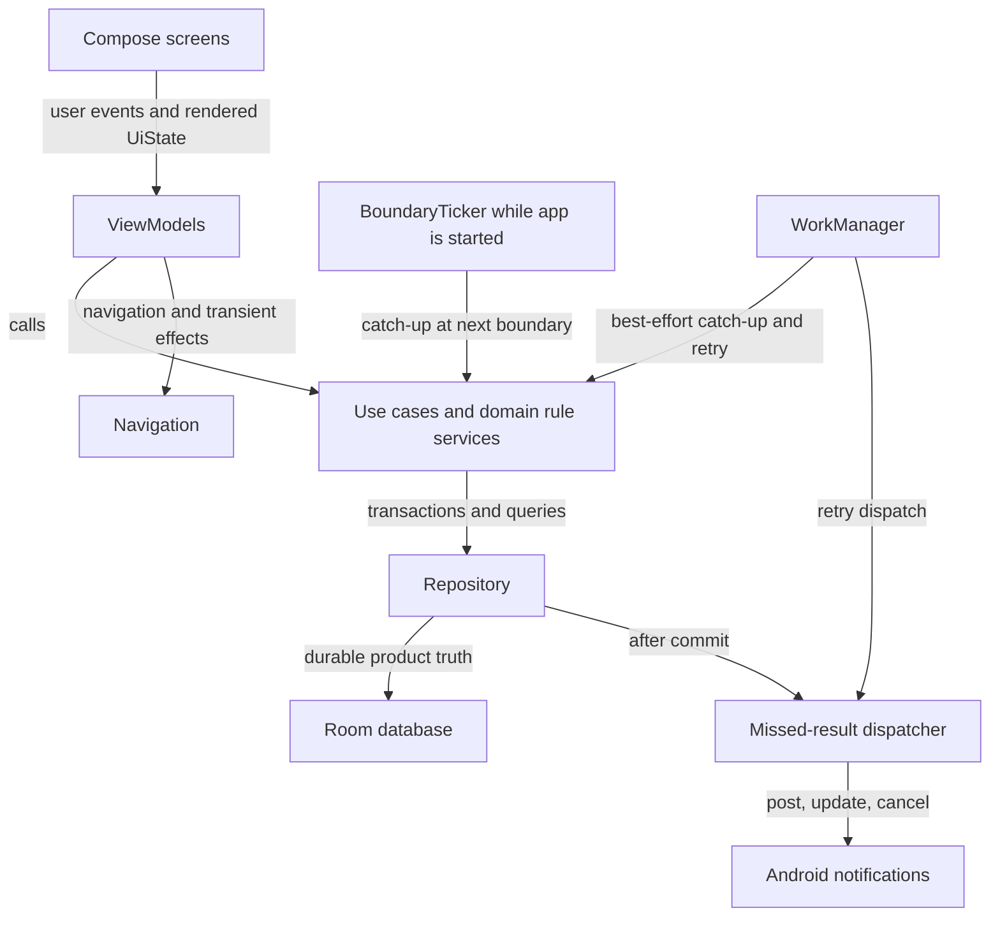
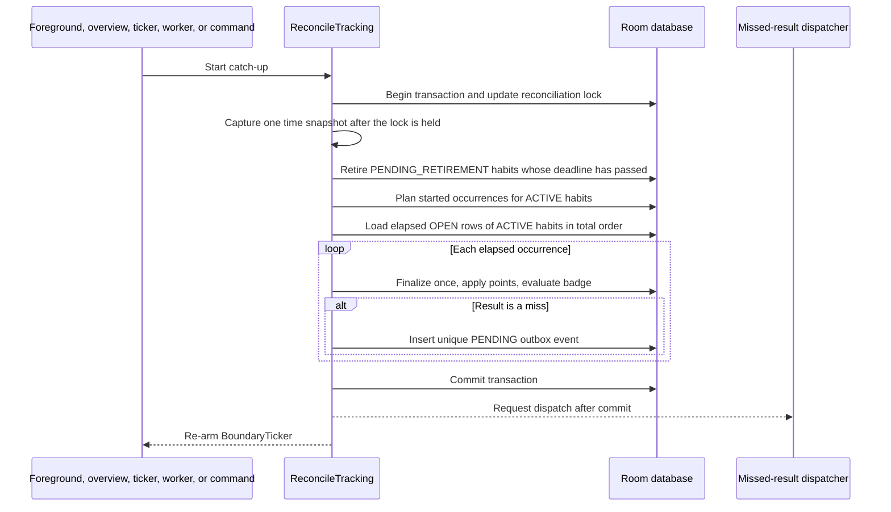
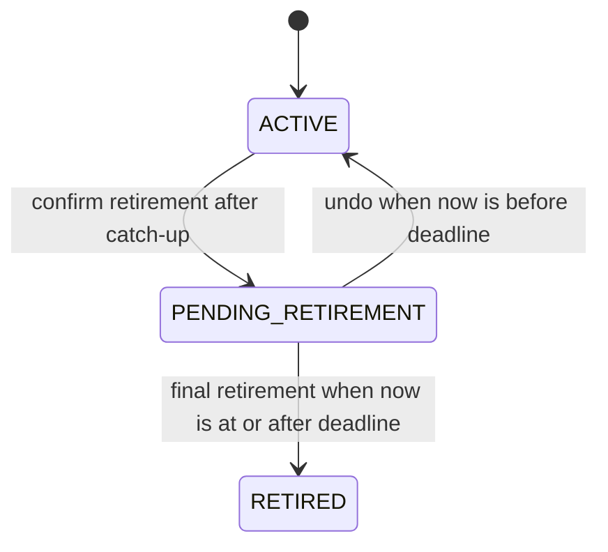
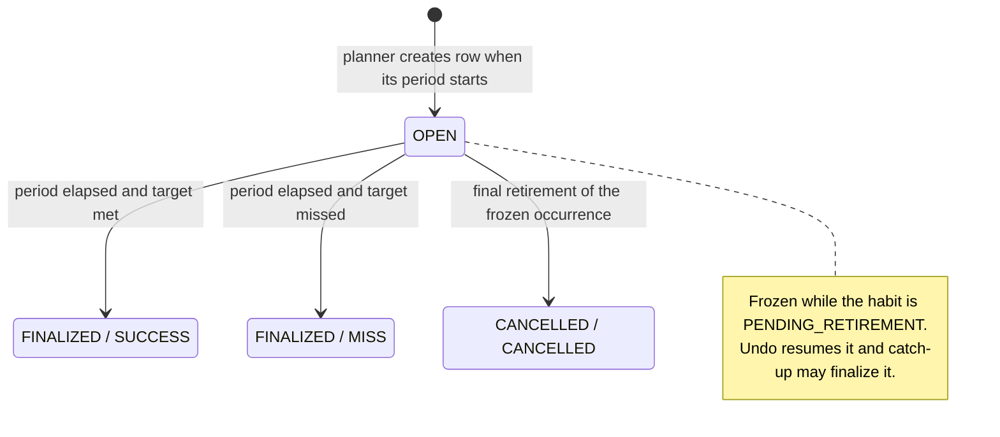
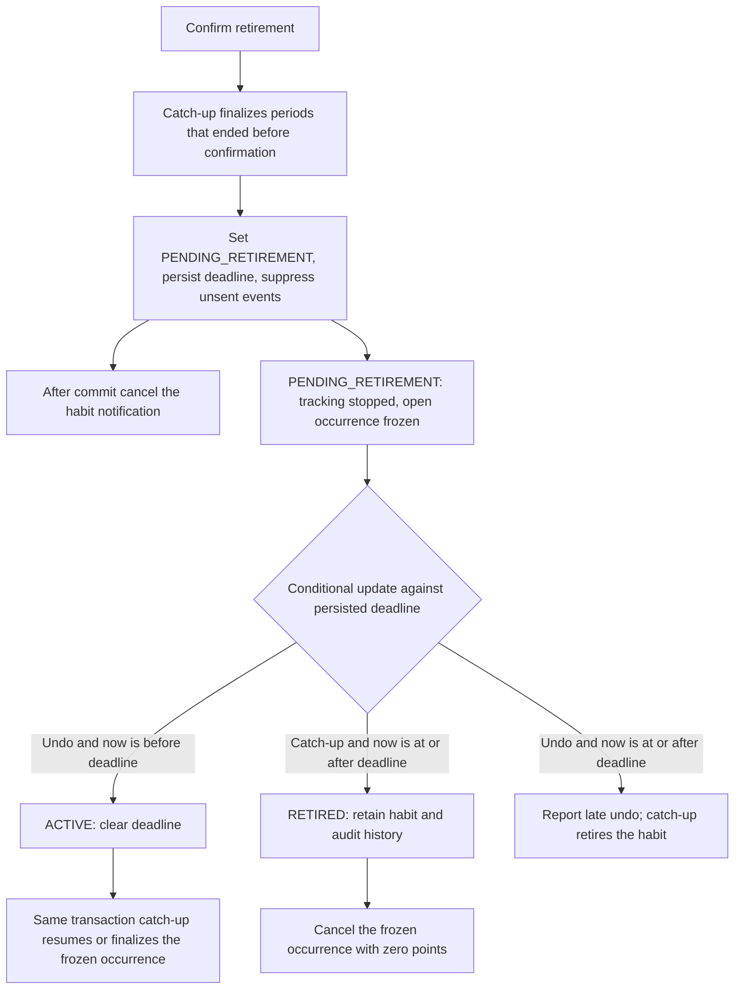
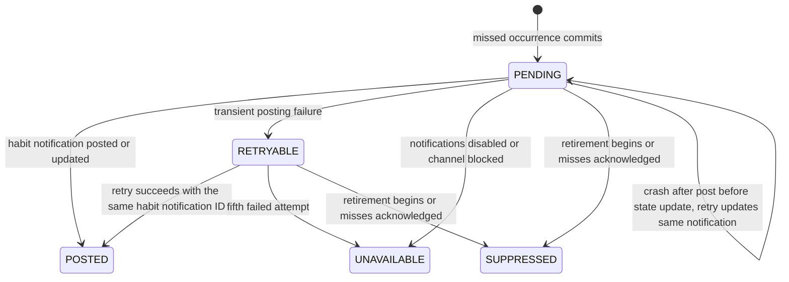
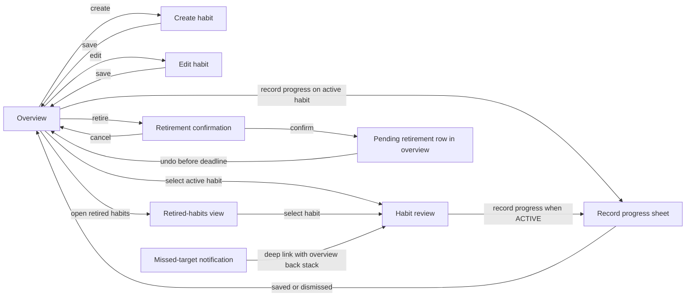

# Habit Tracker V1 — Architecture

## Metadata and authoritative sources

| Field | Value |
| --- | --- |
| Product / feature | Habit Tracker V1 |
| Status | Approved technical architecture |
| Architecture date | 2026-09-21 baseline; 2026-09-23 delta |
| Current approved product source | [`docs/prds/habit-tracker-v1-prd.md`](../prds/habit-tracker-v1-prd.md), including the 2026-09-23 amendment |
| Prior architecture and ADR sources | [ADR 0001](../adr/0001-deterministic-on-device-tracking.md) (superseded); [ADR 0002](../adr/0002-global-catch-up-and-occurrence-continuity.md) (current) |
| Work classification | Architecture delta on the 2026-09-21 baseline |
| Platform | Single-user Android app; minimum API 24; target API 36 |
| Persistence boundary | On-device only |

This document turns the approved product behavior into a technical design. It
does not add product behavior beyond the PRD. It is intentionally designed for
a small, testable Jetpack Compose application, not a multi-module or
client-server system.

### Revision and decision-lock record

| Date | Change | Decision lock |
| --- | --- | --- |
| 2026-09-21 | Baseline architecture; [ADR 0001](../adr/0001-deterministic-on-device-tracking.md). | Recorded before the architecture-creation skill existed. |
| 2026-09-23 | Delta for PRD decisions B1–B9 and architecture decisions A1–A8: global catch-up, start boundaries and one open occurrence, retirement freeze, progress-entry ownership, foreground boundary ticker, per-habit notifications with acknowledgement, schema guards, and input validation; [ADR 0002](../adr/0002-global-catch-up-and-occurrence-continuity.md). | Passed on 2026-09-23 with no product blocker and `Unclassified architecture questions: None`; creator authorized the edit. |

## Scope, constraints, and exclusions

### Affected product requirements

The baseline covers FR-001 through FR-012. The 2026-09-23 delta changes the
realization of FR-001 through FR-006 and FR-008 through FR-012.

### Technical scope and constraints

- Kotlin, Jetpack Compose, and Material 3 in the single `:app` module, package
  `com.codetutor.samplehabittrackerapp`.
- Minimum API 24 requires core-library desugaring for `java.time`; API 26
  introduces notification channels; API 33 introduces the runtime
  notification permission.
- Dependencies and Gradle settings needed for these choices (Room, lifecycle
  ViewModel Compose, lifecycle process, Navigation Compose, WorkManager,
  DataStore, core-library desugaring, and AndroidX notification support) are
  implementation work; they are not changed by this document.

### Out of scope

Backend services, network clients, accounts, sync, export, analytics, extra
badges, implementation plans, and application code.

## Architecture decision register

| Decision | Choice | Rationale | Source or ADR |
| --- | --- | --- | --- |
| UI | Jetpack Compose with Material 3 | Matches the existing app and supports explicit, accessible UI state. | Baseline |
| Presentation state | Screen-level `ViewModel`s exposing immutable `StateFlow<UiState>` | Keeps form, loading, error, and one-off effect state out of composables. | Baseline |
| Domain | Kotlin use cases plus pure rule services | Period, scoring, streak, badge, and validation rules can be deterministically unit-tested. | Baseline |
| Persistence | Room database as the only source of truth for tracking | Habit, immutable history, and finalization must be atomically durable across restarts. | ADR 0002 |
| Schema guards | SQLite triggers created idempotently in Room's `onOpen` callback | Room cannot declare `CHECK` constraints, and its schema validation ignores triggers. | A2; ADR 0002 |
| Catch-up scope | Every period-sensitive command runs full `ReconcileTracking` for all habits under the database gate; the time snapshot is captured after acquiring the gate | One global scoring order regardless of trigger; snapshots never go backward across commits. | A1; ADR 0002 |
| Occurrence time model | Stored start and end instants; one open occurrence per habit; planner watermark | Selecting the current occurrence by instant survives timezone and clock changes. | A3; ADR 0002 |
| Retirement | Freeze the occurrence open at confirmation; cancel at final retirement or resume at undo | Honors PRD B2 deterministically without knowing the winner in advance. | A4; ADR 0002 |
| Background work | WorkManager best-effort reconciliation and notification retry; foreground catch-up and period-sensitive commands are authoritative | Android cannot guarantee exact-time background execution. | Baseline |
| Foreground boundaries | `BoundaryTicker` in the application process while the app is started | The UI stays current across a boundary; provides the retirement-expiry callback. | A6 |
| Notifications | Per-habit notification with stable ID, transactional outbox per missed occurrence, acknowledgement, `SUPPRESSED` state, bounded retry | Bounded notification count and a defined in-app fallback. | A7; ADR 0002 |
| Preferences | DataStore for the notification-permission-requested flag only | Not a source of truth for habits or points. | A7 |
| Time | `java.time` local dates and instants with desugaring for API 24–25 | Calendar semantics without hand-written DST arithmetic. | Baseline |
| Navigation | Navigation Compose with stable habit IDs as arguments | Separates overview, form, progress, and review states without passing domain objects. | Baseline; A5 |

## System shape and ownership



Dependency direction is always inward: UI depends on presentation and domain
contracts; data implements repository contracts; domain does not depend on
Android, Room, Compose, or notification APIs. Room owns every durable fact;
the dispatcher owns only the Android-side effect of a committed outbox event.

Use feature-oriented packages under `com.codetutor.samplehabittrackerapp`.
Exact filenames can evolve, but these boundaries should remain stable.

```text
app/
  HabitTrackerApplication.kt
  navigation/
    HabitTrackerNavHost.kt
  core/
    time/Clock.kt, TimeSnapshot.kt, BoundaryTicker.kt
    ui/UiText.kt
  feature/overview/
    OverviewScreen.kt, OverviewViewModel.kt, OverviewUiState.kt
  feature/habitform/
    HabitFormScreen.kt, HabitFormViewModel.kt, HabitFormUiState.kt
  feature/progress/
    RecordProgressSheet.kt, RecordProgressViewModel.kt, RecordProgressUiState.kt
  feature/review/
    HabitReviewScreen.kt, HabitReviewViewModel.kt, HabitReviewUiState.kt
  feature/retirement/
    RetireHabitViewModel.kt, RetiredHabitsScreen.kt, RetiredHabitsViewModel.kt
  domain/
    model/
    repository/HabitRepository.kt
    usecase/
    rules/OccurrencePlanner.kt, FinalizationEngine.kt, ScoringEngine.kt,
      ContinuityCalculator.kt, BadgeEvaluator.kt, TargetPolicy.kt,
      HabitInputValidator.kt
  data/
    local/HabitTrackerDatabase.kt, SchemaGuards.kt, dao/, entity/
    repository/RoomHabitRepository.kt
    notification/MissedResultDispatcher.kt, NotificationChannels.kt
    preferences/NotificationPermissionStore.kt
    worker/ReconcileTrackingWorker.kt, DispatchMissedResultsWorker.kt
```

Small apps do not need separate Gradle modules. The `domain` package remains
Android-free so it can be unit-tested quickly. A simple application-level
composition root constructs repositories, rule services, workers, the ticker,
and ViewModels.

## Domain, commands, and invariants

Every command below runs in one Room transaction. "Gate" means the first
statement updates the `reconciliation_lock` row; the `TimeSnapshot` (instant,
zone, and local date from `Clock`) is captured immediately after the gate is
held, so a later commit never uses an earlier snapshot unless the device clock
itself moved back.

| Command | Owner and transaction order | Failure or boundary behavior |
| --- | --- | --- |
| `ReconcileTracking` | Gate → snapshot → finalize expired retirements → plan `ACTIVE` habits → finalize elapsed `OPEN` rows of `ACTIVE` habits in total order → insert outbox events. | Idempotent: repeated or concurrent runs apply nothing twice. |
| `CreateHabit` / `EditHabit` | Gate → snapshot → `ReconcileTracking` → validate with `HabitInputValidator` → insert or update. `EditHabit` applies a target change through `TargetPolicy` and records a `target_changes` row. | Invalid or duplicate input is not persisted. A target change arriving after an occurrence closed applies by rule at the snapshot and returns its effective period. `PENDING_RETIREMENT` and `RETIRED` habits reject edits. |
| `SaveProgress` | Gate → snapshot → `ReconcileTracking` → locate the habit's current occurrence → validate → replace `progress`. | Rejected when the habit is not `ACTIVE` or the requested occurrence is no longer `OPEN` and current; the result carries the closed occurrence's final result so the UI can show it while retaining the typed value. |
| `ConfirmRetirement` | Gate → snapshot → `ReconcileTracking` → conditional `ACTIVE → PENDING_RETIREMENT` with `retirementDeadlineEpochMillis = now + 10 000` → mark the habit's `PENDING`/`RETRYABLE` events `SUPPRESSED`. After commit: cancel the habit's notification. | Occurrences that ended before the snapshot are finalized before the freeze; the occurrence open at the snapshot is frozen. |
| `UndoRetirement` | Gate → snapshot → conditional `PENDING_RETIREMENT → ACTIVE` when `now < deadline`, clearing the deadline → `ReconcileTracking`. | When the condition fails, the same catch-up finalizes the expired retirement and the command reports a late undo. |
| `AcknowledgeMisses` | On opening a habit review: set `missAcknowledgedAtEpochMillis` on the habit's unacknowledged `MISS` rows → mark its `PENDING`/`RETRYABLE` events `SUPPRESSED`. After commit: cancel the habit's notification. | Never changes results, points, streaks, or badges; needs no gate. |

Invariants:

- `Habit` stores only mutable current configuration and lifecycle state.
- Each occurrence stores its effective target, so a later target edit never
  rewrites completed history.
- Finalization, result, points effect, badge award, and outbox event commit in
  one transaction. This is the exactly-once boundary.
- The app-wide points balance is a stored aggregate updated in that same
  transaction; `pointsEffect` in occurrence history is its audit trail.
- Active run and Success streak are derived from occurrence rows when read and
  are never stored.
- Exact decimal values use normalized `BigDecimal` text, never binary
  `Double`. Target and progress comparisons happen in Kotlin, not SQL.

### Rule services

| Service | Inputs | Output / invariant |
| --- | --- | --- |
| `HabitInputValidator` | raw name, unit, target, progress text, device locale | Trims name and unit; name 1–50 and unit 1–20 Unicode code points; parses decimals with the locale's decimal separator only (no grouping separators, exponents, or signs); at most 9 integer and 3 fraction digits after removing trailing zeros; target greater than zero, progress zero or greater; returns normalized `BigDecimal` or field-specific errors. Name uniqueness is checked in the command transaction against `nameKey`. |
| `TargetPolicy` | frequency, current occurrence if any, next planned occurrence, requested target | Daily/Custom with a current occurrence: update its `effectiveTarget` and apply from it. Otherwise, or for Weekly/Fortnightly/Monthly: apply from the next occurrence not yet started. Never changes finalized rows. Returns the effective start local date. |
| `ScoringEngine` | result, points balance before result | Success: `+10`. Miss: when the balance is positive, deduct `(balance + 99) / 100` using integer division; the balance never goes below zero. No floating-point arithmetic. |
| `ContinuityCalculator` | the habit's occurrence rows | Active run = number of non-cancelled occurrence rows (rows are created only when their period starts). Success streak = consecutive `SUCCESS` results among finalized rows, newest first, stopping at the first `MISS`. Cancelled rows have no continuity effect. |
| `BadgeEvaluator` | Daily habit's finalized rows | On each Daily finalization, evaluate the 21-local-date window ending on that occurrence's date; award once when it contains at least 18 `SUCCESS` dates. Dates without a row, before creation, or with a miss are non-qualifying. Evaluating the window ending at each finalized date is sufficient to find the first qualifying window. |

## Persistence and historical integrity

IDs are Kotlin `Long` / SQLite `INTEGER`; enum names, names, unit labels, zone
IDs, and ISO-8601 local dates are `String` / `TEXT`; weekday selections are an
`Int` / `INTEGER` bit mask with Monday as bit 0 through Sunday as bit 6; and
exact moments are `Long` / `INTEGER` epoch milliseconds. `BigDecimal` Room
converters serialize every decimal as its normalized plain-string `TEXT` form
(no exponent or redundant trailing zeros) and reject non-normalized database
values. `unit` is only a fixed display label; V1 performs no unit conversion.

| Store or entity | Contract, relationships, and constraints | Query or retention rationale |
| --- | --- | --- |
| `habits` | Non-null: `habitId INTEGER PRIMARY KEY`, `name TEXT`, `nameKey TEXT`, `unit TEXT`, `frequency TEXT`, `selectedWeekdays INTEGER`, `creationLocalDate TEXT`, `currentTarget TEXT`, `status TEXT`. Nullable: `plannedThroughLocalDate TEXT`, `retirementDeadlineEpochMillis INTEGER`, `retiredAtEpochMillis INTEGER`. Indexes `(status, habitId)` and `(nameKey, status)`. `nameKey` is the trimmed name lowercased with `Locale.ROOT`. `plannedThroughLocalDate` is the planner watermark: every candidate occurrence whose start date is on or before it has been created or skipped. | Unit and frequency are immutable after creation. The watermark prevents re-planning after clock or timezone changes. |
| `occurrences` | Non-null: `occurrenceId INTEGER PRIMARY KEY`, `habitId INTEGER`, `startLocalDate TEXT`, `endLocalDate TEXT`, `boundaryZoneId TEXT`, `startInclusiveEpochMillis INTEGER`, `endExclusiveEpochMillis INTEGER`, `effectiveTarget TEXT`, `progress TEXT`, `status TEXT`, `pointsEffect INTEGER`. Nullable: `result TEXT`, `resolvedAtEpochMillis INTEGER`, `missAcknowledgedAtEpochMillis INTEGER`. Foreign key `habitId → habits ON DELETE RESTRICT`; unique `(habitId, startLocalDate)`; indexes `(status, endExclusiveEpochMillis, habitId, occurrenceId)` and `(habitId, result, missAcknowledgedAtEpochMillis)`. `progress` starts at normalized zero. | The unique index also serves per-habit chronological queries. The acknowledgement index serves overview miss counts. |
| `target_changes` | Non-null: `changeId INTEGER PRIMARY KEY`, `habitId INTEGER`, `requestedTarget TEXT`, `effectiveStartLocalDate TEXT`, `changedAtEpochMillis INTEGER`. Foreign key `habitId → habits ON DELETE RESTRICT`; index `(habitId, effectiveStartLocalDate, changeId)`. | Every saved change is retained; a later change with the same effective start supersedes an earlier one, which the review shows as superseded. |
| `app_state` | `appStateId INTEGER PRIMARY KEY` (always 1), `pointsBalance INTEGER NOT NULL`. Exactly one row, initialized with zero. | The balance is explained by `occurrences.pointsEffect`. |
| `badges` | Non-null: `badgeId INTEGER PRIMARY KEY`, `habitId INTEGER`, `type TEXT`, `awardedForLocalDate TEXT`, `awardedAtEpochMillis INTEGER`. Foreign key `habitId → habits ON DELETE RESTRICT`; unique `(habitId, type)`; index `(habitId, awardedForLocalDate)`. | `awardedForLocalDate` is the last date of the qualifying window. |
| `notification_events` | Non-null: `eventId INTEGER PRIMARY KEY`, `occurrenceId INTEGER`, `habitId INTEGER`, `deliveryState TEXT`, `attemptCount INTEGER`. Nullable: `lastAttemptedAtEpochMillis INTEGER`. Foreign keys to `occurrences` and `habits` `ON DELETE RESTRICT`; unique `occurrenceId`; indexes `(deliveryState, habitId)` and `(habitId, deliveryState)`. | One durable event per missed occurrence; notifications are aggregated per habit at dispatch. |
| `reconciliation_lock` | `lockId INTEGER PRIMARY KEY` (always 1), `version INTEGER NOT NULL`. Exactly one row. | Updating it first in a transaction is the database-resident serialization gate. |
| DataStore | One boolean, `notificationPermissionRequested`. | Presentation convenience only; excluded from backup like all user data. |

All listed non-null columns are `NOT NULL` in the Room schema. Enum columns
map to Kotlin enums through type converters.

### Schema guards

Room cannot declare `CHECK` constraints, and its post-migration schema
validation compares columns, foreign keys, and declared indexes but ignores
triggers. `SchemaGuards` therefore holds a fixed list of
`CREATE TRIGGER IF NOT EXISTS` statements executed in `RoomDatabase.Callback.onOpen`,
which runs after creation and after every migration. Each guard is a
`BEFORE INSERT` and `BEFORE UPDATE` trigger that calls `RAISE(ABORT, …)` when:

- an occurrence status/result combination is invalid: `OPEN` must have a null
  result, null resolved-at moment, and zero points effect; `FINALIZED` must
  have result `SUCCESS` or `MISS` and a resolved-at moment; `CANCELLED` must
  have result `CANCELLED`, a resolved-at moment, and zero points effect;
- `missAcknowledgedAtEpochMillis` is non-null on a row whose result is not
  `MISS`, or `startInclusiveEpochMillis` is not less than
  `endExclusiveEpochMillis`;
- a habit's retirement fields do not match its status (`ACTIVE`: both null;
  `PENDING_RETIREMENT`: deadline only; `RETIRED`: both non-null), or
  `selectedWeekdays` is non-zero for a non-Custom habit or outside `1..127`
  for a Custom habit;
- another non-retired habit already has the same `nameKey`;
- `app_state.pointsBalance` would become negative.

Enum domains are enforced by Kotlin enums and converters. Guards must not add
undeclared indexes, because Room's validation would reject them. A migration
test asserts that every guard exists after each migration.

Database migrations must be versioned and tested before a schema change ships.
Never migrate by discarding user history.

## Time, concurrency, and lifecycle

| Risk | Boundary, ownership, or ordering contract | Verification evidence |
| --- | --- | --- |
| Command arrives after a boundary | Every period-sensitive command runs full `ReconcileTracking` under the gate first; `SaveProgress` then changes only a current `OPEN` row. | Repository test: save at and after `endExclusiveEpochMillis` is rejected with the final result. |
| Balance-dependent order | Elapsed rows finalize ordered by `endExclusiveEpochMillis`, `habitId`, `occurrenceId` within each catch-up; because every command catches up all habits, the only exception is a frozen occurrence that becomes eligible at undo. | Repository test: identical final balance whichever command triggers catch-up. |
| Timezone change | Stored start/end instants never change; the planner uses the current zone only for new rows and never starts a row before the previous row's end. | Planner tests for eastward overlap, westward gap, and date-line skip. |
| Device clock moves back | The watermark prevents re-planning; finalized rows stay final; an `OPEN` row whose start is after `now` is not current. | Repository test with a clock moved back across a finalized boundary. |
| App open across a boundary | `BoundaryTicker` runs catch-up at the next boundary. | Instrumented test with a fake clock advancing past a boundary while the overview is shown. |
| Undo versus expiry | Complementary conditions on the persisted deadline under the same gate. | Race test with undo and expiry at the deadline instant. |

### Occurrence planner

`OccurrencePlanner` is a pure service. For an `ACTIVE` habit it iterates
candidate occurrences whose start date is after `plannedThroughLocalDate`
(or starting from the first occurrence when the watermark is null):

| Frequency | First occurrence | Subsequent occurrence |
| --- | --- | --- |
| Daily | Creation date | Each local day |
| Weekly | Creation date when it is a Monday; otherwise the next Monday | Each Monday–Sunday week |
| Fortnightly | Creation date | Consecutive 14-day blocks anchored to the creation date |
| Monthly | Creation date when it is the first day of a month; otherwise the first day of the next month | Each local calendar month |
| Custom | First selected weekday on or after creation | Every selected weekday; each is a one-day occurrence |

For each candidate, in the snapshot's current zone:

1. `localStart` is the start of its first local date and `end` is the start of
   the day after its last local date.
2. `start = max(localStart, previous occurrence's endExclusiveEpochMillis)`.
3. If `start >= end`, skip the candidate: no row is created, and the
   watermark advances past it.
4. Else if `start <= now`, insert the row with its local dates, zone ID,
   `start`, `end`, and `effectiveTarget = currentTarget`, and advance the
   watermark.
5. Else stop; the candidate has not started.

Because rows are created only once they start and never overlap, each habit
has at most one current `OPEN` row after a committed catch-up. No row is created
for an unselected Custom weekday. `OccurrencePlanner.nextStart` returns the
next candidate's start instant for the overview and the ticker.

### Reconciliation sequence

`ReconcileTracking` runs on application foreground, on overview open, from
`BoundaryTicker`, from a periodic best-effort WorkManager worker, and at the
start of every period-sensitive command. Foreground execution and commands own
PRD correctness; worker timing only improves timeliness.



The `OPEN → FINALIZED` update predicates on `status = OPEN`; if it updates
zero rows, another invocation already finalized it. Combined with the unique
occurrence key, the gate, and the single transaction, this makes repeated
starts, worker retries, concurrent triggers, and process death safe.

### Entity states





`PENDING_RETIREMENT` and `RETIRED` habits are excluded from the active
overview and reject progress, edits, occurrence creation, and notification
posting. Catch-up does not finalize `OPEN` rows of a `PENDING_RETIREMENT`
habit. Final retirement never deletes audit records or changes
`app_state.pointsBalance`.

### Retirement resolution



The ticker's deadline wake, application foreground, the worker, and any
command's catch-up all finalize expired retirements. These conditional
transactions and the gate mean undo and expiry cannot both win, including
after process death or restart.

### Foreground boundary ticker

`BoundaryTicker` runs in an application-scoped coroutine only while the
process lifecycle is at least `STARTED`. After every committed catch-up, and
when the system reports a time, date, or timezone change through a
dynamically registered receiver, it computes the next wake instant as the
earliest of: the earliest `endExclusiveEpochMillis` of an `ACTIVE` habit's
`OPEN` row, the earliest pending retirement deadline, and the earliest
`OccurrencePlanner.nextStart` among `ACTIVE` habits. It then delays until that
instant and runs `ReconcileTracking`. Room `Flow` queries update the UI after
the commit. The ticker is a timeliness mechanism; correctness remains with the
command transactions.

## Platform integrations, privacy, and external effects

| Integration or boundary | Contract and failure recovery | Verification evidence |
| --- | --- | --- |
| Missed-result notifications | Transactional outbox with per-habit aggregation, bounded retry, and cancel-on-both-sides for retirement and acknowledgement. | Outbox tests for crash after post, retry exhaustion, aggregation, and the retirement race. |
| Notification permission | API 33+: request once, after the first successful habit creation; record the request in DataStore; never re-request automatically. | Device test with permission denied: events become `UNAVAILABLE` and the overview indicator remains. |
| Notification channel | API 26+: create the "Missed targets" channel in `HabitTrackerApplication.onCreate`. A blocked channel is treated like denied permission. | Device test with the channel blocked. |
| Deep link | Explicit `PendingIntent` to `MainActivity` with `FLAG_IMMUTABLE`, carrying a review deep-link URI; Navigation builds the Overview → Review back stack. No new exported intent filter. | UI test: Back from a notification-opened review returns to the overview. |
| Backup and device transfer | `android:allowBackup="false"`; data-extraction rules exclude `database`, `sharedpref`, `file`, `external`, and `root` from cloud backup and device-to-device transfer. Remove the unused `fullBackupContent` reference. The app uses no device-protected (direct-boot) storage; if it ever does, the `device_*` domains must be excluded too. | Device check of backup and transfer exclusion. |

### Notification outbox and dispatch

A miss inserts one `PENDING` `notification_events` row for its occurrence in
the finalization transaction. The dispatcher runs after commit, on
foreground, and through WorkManager:

1. In a transaction, group `PENDING` and `RETRYABLE` events by habit. Mark a
   group `SUPPRESSED` when the habit is not `ACTIVE` or has no unacknowledged
   misses.
2. When notifications are disabled or the channel is blocked, mark the group
   `UNAVAILABLE`.
3. Otherwise post or update the habit's notification, using a stable `Int`
   derived from `habitId`, stating the habit's unacknowledged-miss count and
   alerting again. Mark the group `POSTED` with a conditional update limited to
   `PENDING` and `RETRYABLE`, so it cannot overwrite a concurrent
   `SUPPRESSED`.
4. On a transient failure, increment `attemptCount` and mark `RETRYABLE`,
   scheduling a WorkManager retry with exponential backoff; after the fifth
   failed attempt, mark `UNAVAILABLE`.
5. After posting, re-read the habit's status and unacknowledged count; when
   the habit is no longer `ACTIVE` or the count is zero, cancel the
   notification.

`ConfirmRetirement` and `AcknowledgeMisses` also cancel the notification after
their commits. Because both sides cancel, a post that races either command
cannot leave a visible notification. A crash after Android accepts a post but
before `POSTED` is recorded causes a retry that updates the same notification.
Undo does not re-post suppressed events; the overview indicator reappears
because the misses remain unacknowledged, and later misses notify normally.



### In-app fallback

The overview's unacknowledged-miss count for a habit is the number of its
`MISS` rows with a null `missAcknowledgedAtEpochMillis`. It is independent of
delivery state, so it covers denied permission, a blocked channel, retry
exhaustion, and suppression. `AcknowledgeMisses` runs when a habit review
opens, whether from the overview, the retired-habits view, or a notification.

## Presentation and navigation



| Screen state | Contents and control policy |
| --- | --- |
| `OverviewUiState` | Points balance; no-habits state; one pending-retirement row per `PENDING_RETIREMENT` habit with a countdown derived from the persisted deadline and an Undo action; and active habit summaries. Each summary has name, unit, schedule, a `CurrentStatus` (`InProgress(target, progress, endsAt)`, `WaitingForFirstPeriod(startsAt)`, `NoOccurrenceToday(nextStartsAt)`, or `BetweenPeriods(nextStartsAt)`), Active run, Success streak, badge flag, and unacknowledged-miss count. |
| `HabitFormUiState` | Preserves all field values while showing field-specific validation errors; after a target change, a saved-effect message names the effective period; after the first successful creation on API 33+, requests notification permission if not requested before. |
| `RecordProgressUiState` | The current occurrence's target, progress, and end; the typed value; field errors; and a late-submission result that shows the closed occurrence's final result while keeping the typed value. |
| `HabitReviewUiState` | Chronological finalized occurrences, target changes with effective periods (superseded changes marked), and badge state. `canTrack` is true only when the loaded habit is `ACTIVE`, regardless of the entry route. |
| `RetiredHabitsUiState` | Retired habits routing to their read-only review; never exposes tracking controls. |

The pending-retirement row is durable state rather than a one-off effect, so it
survives rotation and process death and supports several pending habits at
once. A late undo shows a message with a route to the retired-habits view. UI
effects such as "progress saved" and navigation are emitted separately from
durable UI state.

Composables render state and send events only; they do not calculate schedule,
points, validation, or finalization rules. Give every actionable control and
outcome a semantic label or state description, show textual or iconic
success/miss status in addition to color, and allow layouts to reflow under
system font scaling.

## Error handling and operational limits

- Repository failures become recoverable user-facing states; they never claim
  a save succeeded before its transaction commits.
- Invalid name, unit, target, progress, and Custom weekday input stays in the
  form and is identified at the relevant field.
- There are no network clients, accounts, analytics, cloud sync, exports, or
  remote APIs in V1. The only runtime permission is the notification
  permission on API 33+.
- The app makes no promise that the OS will run work at the exact calendar
  boundary; catch-up on use and in commands guarantees correct durable
  outcomes.

## Requirement traceability and verification

| Product requirement | Architecture responsibility | Focused verification |
| --- | --- | --- |
| FR-001 | `HabitInputValidator`, `CreateHabit`, `nameKey` guard | Validator unit tests for trimming, limits, locale separators, exponent and grouping rejection; repository test for duplicate active names and reuse of retired names. |
| FR-002 | `OccurrencePlanner`, watermark, start/end instants | Planner tests for each cadence's first period (including Monday and first-of-month creation), Custom non-occurrence days, timezone overlap/gap/skip, and clock moved back. |
| FR-003 | `RecordProgressViewModel`, `SaveProgress` | Repository test for replace-not-add and late rejection; UI test that the typed value is retained. |
| FR-004 | `ReconcileTracking`, conditional finalization | Idempotency, overlap, process-death, and total-order tests. |
| FR-005 | `TargetPolicy`, `EditHabit`, `target_changes` | Tests for each cadence, no-open-occurrence changes, late changes, and superseded changes; history unchanged. |
| FR-006 | `OverviewViewModel`, `CurrentStatus`, derived continuity | ViewModel tests for each status and derived Active run/Success streak. |
| FR-007 | `HabitReviewViewModel`, `RetiredHabitsViewModel` | Review ordering and superseded-change display; retired review has no tracking controls from any route. |
| FR-008 | `ScoringEngine`, `ContinuityCalculator`, `BadgeEvaluator`, `app_state`, `badges` | Integer rounding and floor tests; every 21-day window boundary; exactly-once award. |
| FR-009 | Outbox, `MissedResultDispatcher`, `AcknowledgeMisses`, overview indicator | Aggregation, retry exhaustion, crash-after-post, acknowledgement, permission-denied, and deep-link back-stack tests. |
| FR-010 | Retirement commands, freeze, `BoundaryTicker` deadline wake, pending-retirement row | Undo/expiry race, freeze and resume, cancel at final retirement, late undo, countdown after process death. |
| FR-011 | Room, schema guards, migrations, backup configuration | Restart persistence, guard-presence migration test, backup/transfer device check. |
| FR-012 | Compose semantics, validation retention, saved-effect messages | Compose UI tests for accessible states, font scaling, and empty overview. |

## ADRs, deferrals, and open questions

### Related ADRs

- [ADR 0002 — Global catch-up and occurrence continuity](../adr/0002-global-catch-up-and-occurrence-continuity.md)
  (Accepted; current contract).
- [ADR 0001 — Deterministic on-device tracking](../adr/0001-deterministic-on-device-tracking.md)
  (Superseded by ADR 0002; retained for rationale).

### Deliberately deferred decisions

| Deferred item | Why deferred | Later owner | Concrete reopening event |
| --- | --- | --- | --- |
| Dependency-injection library versus a manual composition root | Either satisfies the architecture; the choice depends on implementation size. | Implementation owner | Implementation planning begins. |
| Encryption at rest and PIN protection | No creator-approved threat model exists. | Creator | A threat model is approved. |
| WorkManager periodic cadence and backoff base | An optimization only; correctness does not depend on it. | Implementation owner | The workers are implemented. |
| Exact visual design, copy, charting, and animations | Interaction-design concern. | Interaction-design owner | UX design begins. |

### Open questions

`Unclassified architecture questions: None`
