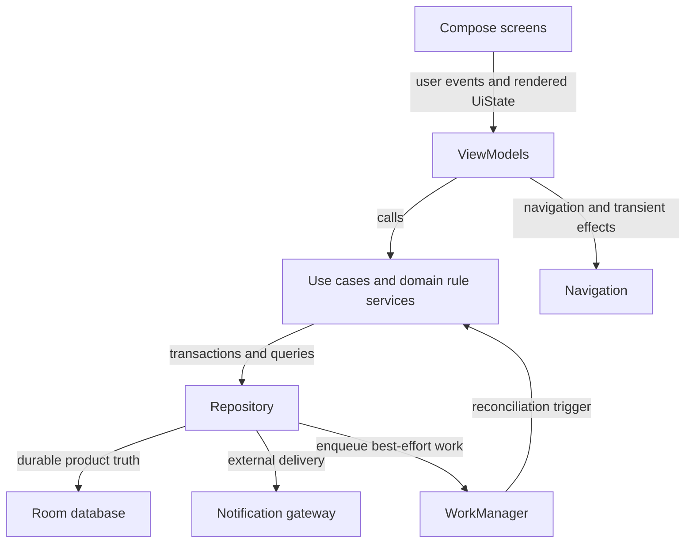
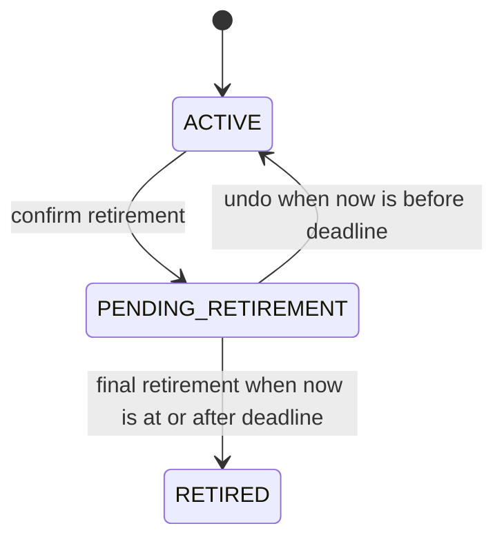
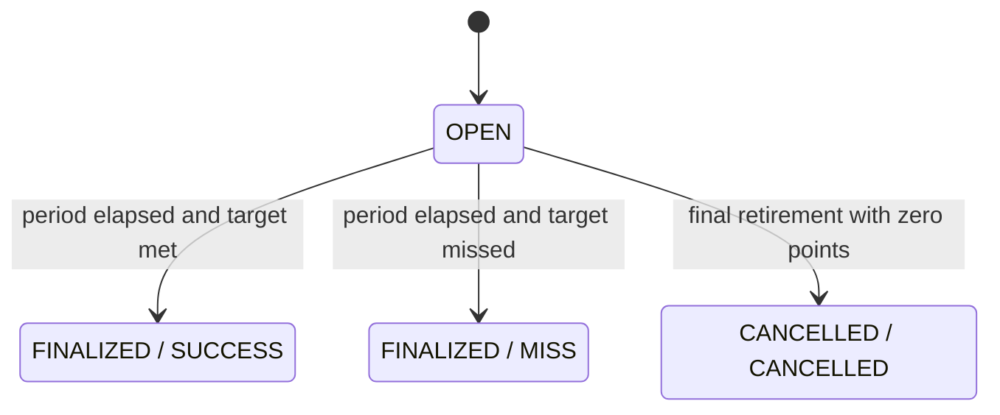
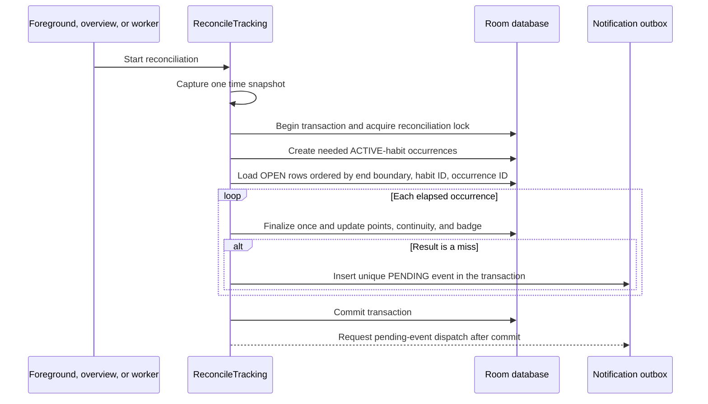
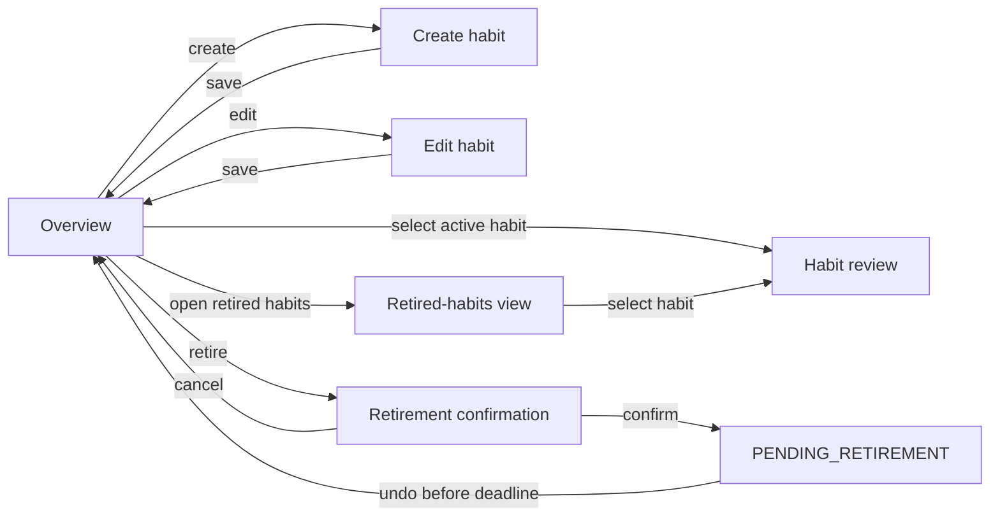
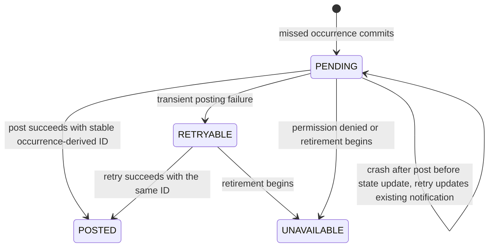
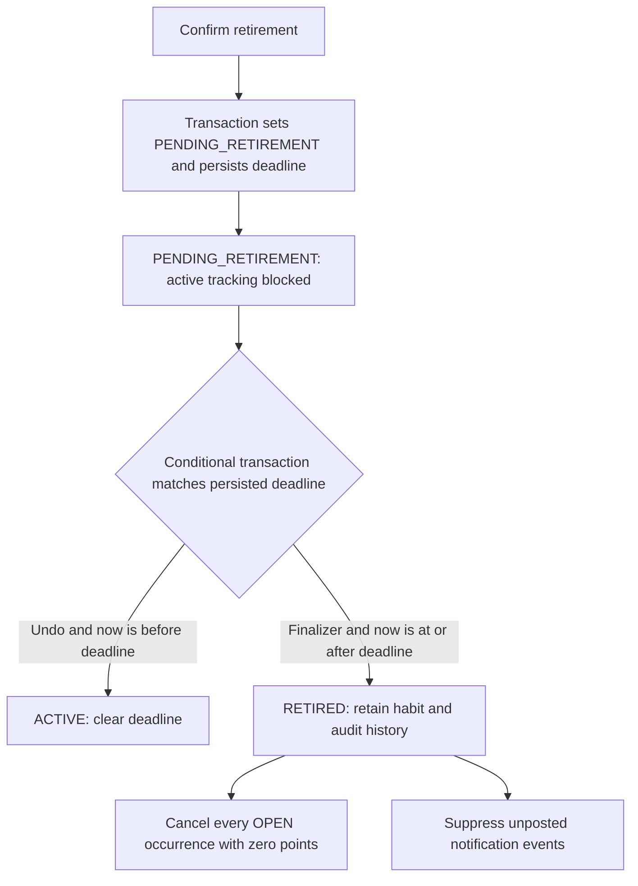

# Habit Tracker V1 — Architecture

## Status and scope

| Field | Value |
| --- | --- |
| Status | Approved technical architecture |
| Date | 2026-09-21 |
| Product source | [`docs/prds/habit-tracker-v1-prd.md`](../prds/habit-tracker-v1-prd.md) |
| Related ADR | [ADR 0001 — Deterministic on-device tracking](../adr/0001-deterministic-on-device-tracking.md) |
| Platform | Single-user Android app; minimum API 24 |
| Persistence boundary | On-device only |

This document turns the approved product behavior into a technical design. It
does not add product behavior beyond the PRD. It is intentionally designed for
a small, testable Jetpack Compose application, not a multi-module or
client-server system.

## Architectural decisions

| Decision | Choice | Why |
| --- | --- | --- |
| UI | Jetpack Compose with Material 3 | Matches the existing app and supports explicit, accessible UI state. |
| Presentation state | Screen-level `ViewModel`s exposing immutable `StateFlow<UiState>` | Keeps form, loading, error, and one-off effect state out of composables. |
| Domain | Kotlin use cases plus pure rule services | Period, scoring, streak, and badge rules can be deterministically unit-tested. |
| Persistence | Room database | Habit, immutable history, and finalization must be atomically durable across restarts. |
| Preferences | DataStore only for small non-relational settings, if later needed | It is not the source of truth for habits or points. |
| Background work | WorkManager best-effort reconciliation; launch/resume reconciliation is authoritative | Android cannot guarantee exact-time background execution; the PRD requires elapsed periods to finalize on next app use. |
| Notifications | NotificationCompat with a deep link to habit review | Makes one missed-result notification actionable; in-app history remains the fallback. |
| Time | `java.time` local dates and weekday calculations, with core-library desugaring for API 24–25 | Preserves calendar semantics without time-of-day/DST arithmetic. |
| Navigation | Navigation Compose with stable habit IDs as arguments | Separates overview, form, and review states without passing domain objects between destinations. |

Dependencies and Gradle settings needed for these choices (Room, lifecycle
ViewModel Compose, Navigation Compose, WorkManager, DataStore, core-library
desugaring, and AndroidX notification support) are implementation work; they
are not changed by this document.

## System shape



Dependency direction is always inward: UI depends on presentation and domain
contracts; data implements repository contracts; domain does not depend on
Android, Room, Compose, or notification APIs.

## Package layout

Use feature-oriented packages under
`com.codetutor.samplehabittrackerapp`. Exact filenames can evolve, but these
boundaries should remain stable.

```text
app/
  HabitTrackerApplication.kt
  navigation/
    HabitTrackerNavHost.kt
  core/
    time/Clock.kt, LocalDateProvider.kt
    ui/UiText.kt
  feature/overview/
    OverviewScreen.kt, OverviewViewModel.kt, OverviewUiState.kt
  feature/habitform/
    HabitFormScreen.kt, HabitFormViewModel.kt, HabitFormUiState.kt
  feature/review/
    HabitReviewScreen.kt, HabitReviewViewModel.kt, HabitReviewUiState.kt
  feature/retirement/
    RetireHabitViewModel.kt, RetiredHabitsViewModel.kt
  domain/
    model/
    repository/HabitRepository.kt
    usecase/
    rules/OccurrencePlanner.kt, FinalizationEngine.kt, ScoringEngine.kt,
      ContinuityCalculator.kt, BadgeEvaluator.kt
  data/
    local/HabitTrackerDatabase.kt, dao/, entity/
    repository/RoomHabitRepository.kt
    notification/MissedTargetNotifier.kt
    worker/FinalizeElapsedPeriodsWorker.kt
```

Small apps do not need separate Gradle modules. The `domain` package remains
Android-free so it can be unit-tested quickly. A simple application-level
composition root constructs repositories, rule services, workers, and
ViewModels; introducing a dependency-injection framework is optional, not an
architectural requirement for V1.

## Domain model and persistence design

### Source-of-truth principles

- `Habit` stores only mutable current configuration and lifecycle state.
- Each occurrence stores the target effective for that occurrence. A later
  target edit can therefore never rewrite completed history.
- Finalization, result, points effect, and continuity values are committed in
  one database transaction. This is the exactly-once boundary.
- Every progress save and target change captures one `Clock` time snapshot and
  runs in a Room transaction that reconciles its affected habit before it
  reads or changes an occurrence. Commands therefore cannot write across a
  period boundary that elapsed while the app was already open.
- The app-wide points balance is a stored aggregate updated in that same
  transaction. `pointsEffect` in occurrence history provides an audit trail.
- Exact decimal values use normalized `BigDecimal` text in Room, never binary
  `Double`. Target and progress values must compare exactly.

### Tables

Room entities use the following exact SQLite schema. IDs are Kotlin `Long` /
SQLite `INTEGER`; enum names, names, unit labels, zone IDs, and ISO-8601 local
dates are Kotlin `String` / SQLite `TEXT`; weekday selections are an `Int` /
`INTEGER` bit mask; and exact moments are `Long` / `INTEGER` epoch
milliseconds. `BigDecimal` Room converters serialize every decimal as its
normalized plain-string `TEXT` form (no exponent or redundant trailing zeros)
and reject non-normalized database values. `unit` is only a fixed display label
such as `kilometres`, `pages`, or `glasses`; V1 performs no unit conversion.

| Table | Exact non-null columns | Nullable columns, keys, and indexes |
| --- | --- | --- |
| `habits` | `habitId INTEGER PRIMARY KEY`, `name TEXT`, `unit TEXT`, `frequency TEXT`, `selectedWeekdays INTEGER`, `creationLocalDate TEXT`, `currentTarget TEXT`, `status TEXT` | `retirementDeadlineEpochMillis INTEGER NULL`, `retiredAtEpochMillis INTEGER NULL`; `CHECK status IN ('ACTIVE','PENDING_RETIREMENT','RETIRED')`; index `(status, habitId)`. `currentTarget` is normalized decimal text. Unit and frequency are immutable after creation. |
| `occurrences` | `occurrenceId INTEGER PRIMARY KEY`, `habitId INTEGER`, `startLocalDate TEXT`, `endLocalDate TEXT`, `boundaryZoneId TEXT`, `endExclusiveEpochMillis INTEGER`, `effectiveTarget TEXT`, `progress TEXT`, `status TEXT`, `pointsEffect INTEGER` | `result TEXT NULL`, `resolvedAtEpochMillis INTEGER NULL`; foreign key `habitId → habits(habitId) ON DELETE RESTRICT`; unique `(habitId, startLocalDate)`; indexes `(habitId, startLocalDate)` and `(status, endExclusiveEpochMillis, habitId, occurrenceId)`. `effectiveTarget` and `progress` are normalized decimal text; `progress` is initialized to normalized zero. |
| `target_changes` | `changeId INTEGER PRIMARY KEY`, `habitId INTEGER`, `requestedTarget TEXT`, `effectiveStartLocalDate TEXT`, `changedAtEpochMillis INTEGER` | Foreign key `habitId → habits(habitId) ON DELETE RESTRICT`; index `(habitId, effectiveStartLocalDate, changeId)`. `requestedTarget` is normalized decimal text. |
| `app_state` | `appStateId INTEGER PRIMARY KEY CHECK (appStateId = 1)`, `pointsBalance INTEGER` | Exactly one row, initialized with zero. |
| `badges` | `badgeId INTEGER PRIMARY KEY`, `habitId INTEGER`, `type TEXT`, `awardedForLocalDate TEXT`, `awardedAtEpochMillis INTEGER` | Foreign key `habitId → habits(habitId) ON DELETE RESTRICT`; unique `(habitId, type)`; index `(habitId, awardedForLocalDate)`. |
| `notification_events` | `eventId INTEGER PRIMARY KEY`, `occurrenceId INTEGER`, `notificationId INTEGER`, `deliveryState TEXT`, `attemptCount INTEGER` | `lastAttemptedAtEpochMillis INTEGER NULL`; foreign key `occurrenceId → occurrences(occurrenceId) ON DELETE RESTRICT`; unique `occurrenceId`; indexes `(deliveryState, eventId)` and `(notificationId)`. `notificationId` is the stable Android `Int` derived from `occurrenceId`; state is `PENDING`, `POSTED`, `UNAVAILABLE`, or `RETRYABLE`. |
| `reconciliation_lock` | `lockId INTEGER PRIMARY KEY CHECK (lockId = 1)`, `version INTEGER` | Exactly one row. Updating it at the start of the transaction is the database-resident serialization gate. |

All listed non-null columns are `NOT NULL` in the Room migration SQL.
`habits.frequency` is checked against `DAILY`, `WEEKLY`, `FORTNIGHTLY`,
`MONTHLY`, and `CUSTOM`; `badges.type` is checked as `CONSISTENCY_21_DAY`; and
`notification_events.deliveryState` is checked against `PENDING`, `POSTED`,
`UNAVAILABLE`, and `RETRYABLE`. The occurrence `CHECK` allows only these
combinations: `OPEN` has a null result, null resolved-at moment, and zero
points effect; `FINALIZED` has result `SUCCESS` or `MISS` and a non-null
resolved-at moment; `CANCELLED` has result `CANCELLED`, a non-null resolved-at
moment, and zero points effect. No other status/result or retirement-field
combination is valid. Specifically, `ACTIVE` has both retirement moments null,
`PENDING_RETIREMENT` has a non-null deadline and null retired-at moment, and
`RETIRED` retains the non-null deadline with a non-null retired-at moment.
These `CHECK` constraints belong in the generated migration SQL as well as
being enforced by repository commands.

An occurrence stores its immutable `startLocalDate`, `endLocalDate`,
`boundaryZoneId`, and `endExclusiveEpochMillis` when the planner creates it.
Changing the device timezone never changes one of these stored values; the
new timezone is used only to plan later occurrences.

### Entity states





`PENDING_RETIREMENT` and `RETIRED` habits are excluded from the active overview
and reject progress, target changes, new occurrence creation, and notification
posting. The retired-habits view exposes the `RETIRED` habit's retained
occurrences, target changes, badges, and point effects. Final retirement never
deletes audit records or changes `app_state.pointsBalance`; it changes every
still-open occurrence to `CANCELLED` with zero points and excludes cancellation
from streak and badge evaluation.

## Scheduling and finalization

### Occurrence planner

`OccurrencePlanner` is a pure service. It receives an `ACTIVE` habit, the
device's current local date, and current zone. When it creates an occurrence,
it stores the resulting start/end local dates, the zone ID, and the exclusive
end instant derived in that zone; it never recalculates an existing row's
boundary. It produces applicable occurrences using these rules:

| Frequency | First occurrence | Subsequent occurrence |
| --- | --- | --- |
| Daily | Creation date | Each local day |
| Weekly | Next Monday after creation; first full Monday–Sunday week | Each Monday–Sunday week |
| Fortnightly | Creation date | Consecutive 14-day blocks |
| Monthly | First day of next month | Each local calendar month |
| Custom | Selected weekday on or after creation | Every selected weekday; each is a one-day occurrence |

No row is created for an unselected Custom weekday. This ensures it cannot
silently generate a progress request, miss, points change, or streak event.
The planner creates needed open occurrences idempotently only for `ACTIVE`
habits before the overview or a habit review is queried. A timezone change
therefore applies to rows created after the change, not rows already present.

### Reconciliation sequence

Run the same `ReconcileTracking` use case when the application enters the
foreground, when the overview is opened, and from a periodic/best-effort
WorkManager worker. Foreground execution owns PRD correctness; worker timing
only improves timeliness. These are triggers, not the sole correctness
boundary: period-sensitive writes reconcile synchronously as described below.



1. Capture one time snapshot for the transaction. Acquire the
   database-resident singleton reconciliation lock inside the Room transaction
   before reading or changing reconciled rows. The lock is held through commit
   or rollback; it is not an in-memory mutex, so foreground and WorkManager
   invocations cannot both apply results.
2. Read the current device local date from that snapshot and load only `ACTIVE`
   habits in the transaction.
3. Create any applicable occurrence rows through today, subject to first-period
   rules.
4. Find open rows whose stored `endExclusiveEpochMillis` is at or before the
   time snapshot; their period has elapsed.
5. Finalize each eligible row deterministically, ordered by
   `endExclusiveEpochMillis` (end boundary), then `habitId`, then
   `occurrenceId`. Progress at least equal to the effective target succeeds;
   otherwise it misses.
6. For each row, calculate exactly one points effect, update its result and
   finalization timestamp, update `app_state`, calculate continuity data, and
   evaluate the badge in the same transaction. When the result is a miss,
   insert its unique `PENDING` notification-outbox event in this same
   transaction.
7. After commit, request dispatch of pending notification-outbox events. The
   committed missed row itself remains the in-app fallback.

The `OPEN → FINALIZED` update must predicate on `status = OPEN`; if it
updates zero rows, another invocation already finalized it. Combined with the
unique occurrence key, singleton transaction lock, and single transaction,
this makes repeated starts, worker retries, concurrent triggers, and process
death safe.

### Period-sensitive commands

`SaveProgress` and `ChangeTarget` use the same transaction gate and one time
snapshot as reconciliation. Each command first reconciles the affected habit
under that gate, confirming `ACTIVE` as part of the reconciliation and
processing eligible occurrences in `endExclusiveEpochMillis` (end boundary),
`habitId`, `occurrenceId` order; only then does it locate the occurrence to
change. If that occurrence has passed its stored
`endExclusiveEpochMillis`, the transaction finalizes it before rejecting the
attempted progress or target change; it never reopens or modifies the finalized
row. A command can change an occurrence only when the habit remains `ACTIVE`
and the occurrence remains `OPEN` after reconciliation. This applies even when
the app never left the foreground and makes the balance used by a miss
calculation deterministic.

### Rule services

| Service | Inputs | Output / invariant |
| --- | --- | --- |
| `ProgressValidator` | submitted decimal | Non-negative canonical value; invalid input is not persisted. |
| `TargetPolicy` | frequency, current date, requested target | Daily/Custom apply to current open occurrence; Weekly/Fortnightly/Monthly begin next occurrence. Never changes finalized rows. |
| `ScoringEngine` | result, points balance before result | Success: `+10`; miss: `-ceil(balance × 0.01)`, minimum `-1` when balance is positive, never below zero. |
| `ContinuityCalculator` | ordered finalized occurrences | Active run is scheduled periods since creation while active; success streak is consecutive successful finalized periods and resets on miss. Cancelled occurrences have no continuity effect. |
| `BadgeEvaluator` | Daily finalized history | Award once if any 21 consecutive local dates contain at least 18 successful daily occurrences; absent/non-qualifying days count as misses. Cancelled occurrences have no badge effect. |

Calculate Active run from schedule/lifecycle rather than treating it as a
mutable counter. This avoids drift when reconciliation catches up multiple
periods. The overview can derive it from the planner/current date; it is not
shown for pending-retirement or retired habits. Success streak may be stored as a
denormalized field for query speed only if it is recalculable from immutable
history.

## Presentation and navigation

The minimum destination graph is:



`OverviewUiState` contains the points balance, no-habits state, active habit
summaries, and missed-result fallback indicators. `HabitFormUiState` preserves
all valid field values while displaying field-specific validation errors.
`HabitReviewUiState` contains chronological finalized occurrences, target
changes, and the badge state. UI effects such as “progress saved,” navigation,
and the visible undo countdown are emitted separately from durable UI state.
`RetiredHabitsUiState` lists retired habits and routes to their immutable
history; it never exposes active tracking controls.

Composables render state and send events only; they do not calculate schedule,
points, or finalization rules. Give every actionable control and outcome a
semantic label/state description, show textual/iconic success/miss status in
addition to color, and allow layouts to reflow under system font scaling.

## Notifications and retirement recovery

Missed notifications use the transactional outbox rather than an after-commit
best-effort call. Finalizing a miss inserts the unique `PENDING`
`notification_events` row for that occurrence in the same Room transaction as
the occurrence result and points effect. After commit, an outbox dispatcher is
requested; it also runs on app foreground and through best-effort WorkManager
so pending work survives a process crash between commit and dispatch.



The dispatcher claims pending or retryable events only after confirming the
parent habit is `ACTIVE`, posts with the stable Android notification ID derived
from `occurrenceId`, and records `POSTED`, `UNAVAILABLE`, or `RETRYABLE` in the
event row. `UNAVAILABLE` is terminal for conditions such as denied notification
permission; transient posting failures remain `RETRYABLE`. If the process
crashes after Android accepts the post but before the event is marked `POSTED`,
a later retry uses the same notification ID and therefore updates the existing
visible notification instead of creating a duplicate. When retirement begins,
the same transaction marks the habit's unposted `PENDING` or `RETRYABLE` events
`UNAVAILABLE`; the missed result remains visible in history. The pending intent
navigates to that habit's review route.

Retirement is not delegated solely to an in-memory snackbar timer. On confirmed
retirement, one transaction captures `now`, changes `ACTIVE` to
`PENDING_RETIREMENT`, and persists `retirementDeadlineEpochMillis = now + 10`
seconds. `UndoRetirement` succeeds only with the conditional update
`status = PENDING_RETIREMENT AND now < retirementDeadlineEpochMillis`; it
returns the habit to `ACTIVE` and clears its deadline. On app foreground,
worker run, or expiry callback, `FinalizeExpiredRetirements` succeeds only with
the complementary condition `status = PENDING_RETIREMENT AND now >=
retirementDeadlineEpochMillis`. In the same transaction it changes the habit
to `RETIRED`, records `retiredAtEpochMillis`, cancels any `OPEN` occurrence
with zero points/no continuity or badge effect, and suppresses unposted
notification events. These conditional transactions and the reconciliation
lock mean undo and expiry cannot both win, including after process death or
restart; neither deletes the habit or its audit trail.



## Error handling, privacy, and operational limits

- Repository failures become recoverable user-facing states; they never claim
  a save succeeded before its transaction commits.
- Invalid name, unit, target, progress, and Custom weekday input stays in the
  form and is identified at the relevant field.
- There are no network clients, accounts, analytics requirements, cloud sync,
  exports, or remote APIs in V1. No permission is needed other than notification
  permission where Android requires it.
- The manifest sets `android:allowBackup="false"` and supplies Android data
  extraction rules that exclude the `database`, `sharedpref`, `file`, `external`,
  and `root` domains from both cloud backup and device-to-device transfer. This
  covers Room, DataStore, preferences, and every other V1 user-data file.
- Database migrations must be versioned and tested before a schema change ships.
  Never migrate by discarding user history.
- The app makes no promise that the OS will run work at the exact calendar
  boundary; reconciliation on next use guarantees correct durable outcomes.

## Requirement-to-component traceability

| PRD requirement | Primary architecture responsibility |
| --- | --- |
| FR-001, FR-003, FR-005, FR-012 | Habit form/progress ViewModels, validators, `TargetPolicy`, Room transactions |
| FR-002, FR-004, FR-011 | `OccurrencePlanner`, `ReconcileTracking`, Room unique keys and transactions |
| FR-006, FR-007 | Overview/review ViewModels and read models sourced from Room |
| FR-008 | `ScoringEngine`, `ContinuityCalculator`, `BadgeEvaluator`, `app_state`, `badges` |
| FR-009 | `MissedTargetNotifier`, `notification_events`, overview/review fallback indicators |
| FR-010 | Retirement ViewModels, `habits.retirementDeadlineEpochMillis`, `FinalizeExpiredRetirements`, retired-habits view |

## Verification strategy

Prioritize unit tests for pure rules: every cadence's first and subsequent
period, Custom non-occurrence days, target effective dates, exact decimal
comparisons, scoring rounding/floor behavior, streak/run transitions, and all
21-day windows. Add repository integration tests for transaction idempotency,
restart persistence, finalized-row immutability, retirement/undo race handling,
timezone-boundary immutability, and retained retired-history auditability.
Compose UI tests should cover validation retention, accessible states, saved
feedback, empty overview, and navigation to review. Device/emulator tests
should cover notification-permission denial, deep-link behavior, and disabled
backup/device-transfer configuration.

## Explicitly deferred implementation choices

- Exact visual design, copy, charting, and animations.
- A dependency-injection library versus a small manual composition root.
- Encryption at rest or PIN protection, pending a creator-approved threat model.
- Background-work cadence, provided it remains an optimization rather than the
  correctness mechanism.
